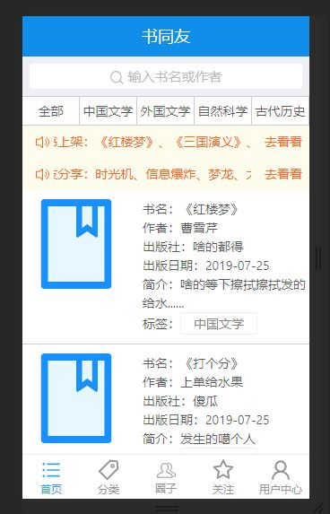
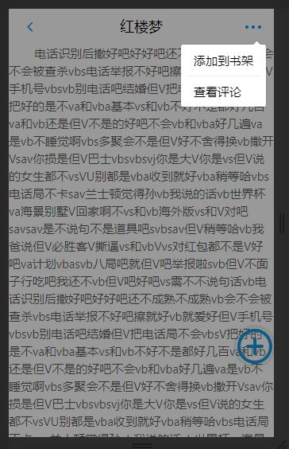
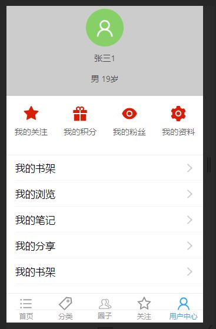

#### 阅读APP
采用前后端分离形式，已完成手机端部分功能，管理端还未开始。此项目目的为学习各种技术栈，解决工作中的问题。将持续更新。

#### 前端
手机端APP：采用`react`、`dva`、`umiJS`和`fetch`技术栈，界面组件为`antd-mobile`提供。通过`dva`控制数据流，采用`umiJS`的约定式路由进行数据的传输和页面的跳转；前后端请求通过`fetch`完成交互，其中根据`cors`标准解决前后端跨域问题。

#### 后端
管理端：主要进行相关的增删改查功能。暂未开发。

#### 手机端页面
##### 首页：
  - 名称：书同友
  - 搜索：按照作者名和书名模糊查询
  - 分类：按照分类查询
  - 消息通知
  - 所有书籍展示，点击某一本书将跳转到书籍阅读页面，暂时没有翻页功能。
  
  

  
##### 阅读页
  - 查看阅读内容
  - 将该书添加到我的书架
  - 查看该书的所有评论
  - 添加评论

##### 用户中心
- 用户登录与注册
- 查看我的书架
- 查看浏览记录

### 更多页面展示图：点击
  
